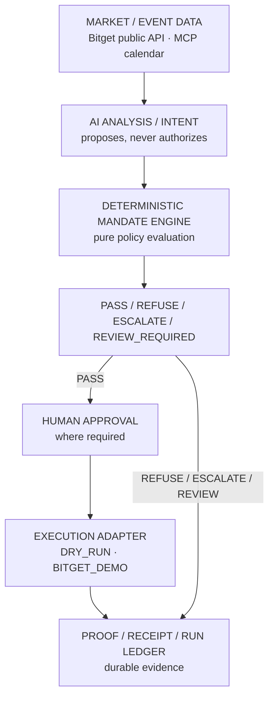
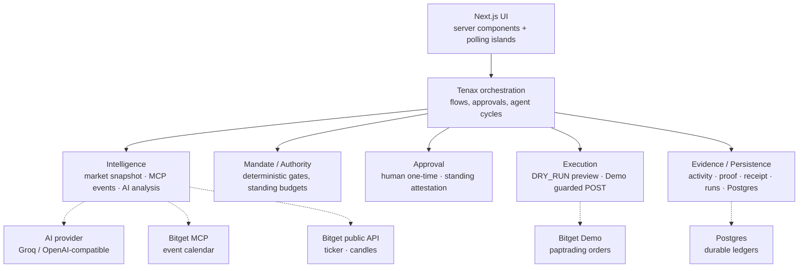

# Tenax

**The authority layer for AI trading agents.**

> AI can propose. It cannot authorize itself.

Tenax separates probabilistic intelligence from deterministic execution authority.
Models analyze markets and propose actions — but deterministic mandates decide
whether those actions are actually allowed to reach execution, and durable
evidence records what happened either way.

```text
EVENT → INTENT → AUTHORITY → EXECUTION → PROOF
```

## Proof at a glance

- **REFUSE** — authority exceeded; no order sent. Generated by the zero-credential demo.
- **PREVIEW** — authorized DRY_RUN; no provider submission and no funds moved. Generated by the zero-credential demo.
- **FILLED** — provider-verified Bitget Demo execution. Historical evidence, visible where that verified record is present in the deployed database.

## Judge Tenax in 90 seconds

1. Open `[HOSTED_TENAX_URL]` → click **SEE DEMO**.
2. Run **AUTHORITY STOP** → observe `REFUSE → NO ORDER SENT`.
3. Open the durable run and proof.
4. Back on Demo, run **AUTHORIZED EXECUTION** → observe `PASS → EXECUTED → PREVIEW → NO FUNDS MOVED`.
5. Open the run and receipt.
6. Visit **Paper Trading** and compare the `REFUSED` and `EXECUTED` rows side by side.
7. Visit **Capital → NVIDIA exposure** for live Bitget public market data.
8. If the deployed database carries it, inspect the provider-backed `FILLED`
   run (`paper-run:v1:flow-0001`). Fresh databases contain only what the demo
   generates — the zero-credential demo always produces the refusal and the
   preview. The historical FILLED run is visible only when that verified
   evidence is present in the deployed database.

## The problem

Most AI trading systems fuse market reasoning, decision generation, authority,
and execution inside effectively the same agent loop. That bakes in a dangerous
assumption: **if the model decides it, the system may execute it.**

That is insufficient for autonomous financial software:

- model reasoning is probabilistic, not permission;
- financial authority should be explicit and inspectable;
- execution limits should be deterministic, not vibes;
- human-approval boundaries should be mechanically enforced;
- refusals must happen *before* an order exists, not after a loss;
- every outcome — including refusals — needs durable evidence.

Tenax answers a different question from a trading bot. Not only
“What should the agent trade?” but **“What is this agent actually allowed to
do, who granted that authority, and what evidence proves what happened?”**

## Three verified Tenax outcomes

The same rails carry all three terminal outcomes. Values below are genuine
repository/persistence truth (verified live against Postgres).

| | Authority stop | Authorized preview | Verified Demo fill |
|---|---|---|---|
| Exposure | $500 simulated NVIDIA | $500 simulated NVIDIA | $500 simulated NVIDIA |
| Proposal | 40% / $200 | 20% / $100 | 20% / $100, 1x |
| Mandate | max 30% / $150 | max 30% / $150 | max 30% / $150 |
| Authority | **REFUSE** | **PASS** + authorized | **PASS**, 16/16 gates |
| Execution | **NO ORDER SENT** | **PREVIEW**, submitted: false, no funds moved | **FILLED**, order `1491995256369336320` @ 236.46 |
| Evidence | proof + run | receipt + run | proof + run + receipt |

**Authority stop.** The AI asked for more authority than it had (40% exceeds
30%, $200 exceeds $150). Tenax refused before any order could exist and
persisted the refusal as evidence.

**Authorized preview.** The full authorized execution path runs to completion
without pretending an exchange order occurred: the DRY_RUN adapter constructs
the exact would-be order, submits nothing, moves nothing.

**Verified Bitget Demo execution.** Actual Bitget **Demo** submission (never
live money), verified through order-status lookup — `FILLED` is reported only
because the provider explicitly said so:

- run `paper-run:v1:flow-0001` · proof `proof:v1:EXECUTION_FILLED:act-0003` · receipt `TENAX-1C-flow-0001`
- side short/sell · qty 0.42 · 1x crossed · NVDAUSDT
- the Demo account was afterwards flattened with a separately authorized close
  and is currently flat; the close is operational cleanup, not product proof.

## How Tenax works



The rules are simple and load-bearing:

- **AI produces intent.** It recommends a percentage and a rationale. Nothing more.
- **The mandate engine determines authority.** Mandate bounds live outside
  model authority: the model cannot read, change, or bypass them, and its
  output is never silently clamped into compliance — deterministic Tenax logic
  independently evaluates every proposal.
- **Execution cannot grant itself permission.** Adapters submit only with a
  passing verdict plus the required approval, re-verified at call time.
- **Evidence records what actually happened** — fills, previews, and refusals alike.

## Authority outcomes

| Outcome | Meaning |
|---|---|
| `PASS` | Within the current mandate. This does **not** mean automatic execution — remaining approval and execution requirements still apply. |
| `REFUSE` | Outside allowed authority. **No order is sent.** A refusal is a successful authority outcome, not a failed order. |
| `ESCALATE` | Requires higher authority. **No autonomous order.** Routes to human review. |
| `REVIEW_REQUIRED` | A person must approve before execution may continue. **No order until they do.** |

## What is real vs simulated

Tenax's credibility comes from never blurring this line:

| Capability | Source / mode | Reality |
|---|---|---|
| NVIDIA exposure ($500) | Tenax fixture | **SIMULATED EXPOSURE** — never presented as owned |
| Judge demo analyses | `DEVELOPMENT_FIXTURE` | **Fixture reasoning**, explicitly labeled |
| Mandate evaluation | Tenax domain logic | **DETERMINISTIC TENAX LOGIC** — pure policy evaluation |
| Authority outcomes | Tenax policy engine | **REAL allow/refuse/escalate decisions** |
| DRY_RUN execution | Tenax execution adapter | **DRY_RUN · NO PROVIDER SUBMISSION** — real construction path, zero submission |
| Bitget Demo fill | Bitget Demo + status verification | **BITGET DEMO · PROVIDER-BACKED** — explicit fill confirmation |
| Live ticker / candles | Bitget public market API | **LIVE PUBLIC MARKET DATA**, no credentials needed |
| Event intelligence | Bitget MCP calendar | **LIVE WHEN AVAILABLE · FAIL-CLOSED** (`SOURCE_UNAVAILABLE`) when not |
| Proof / run / receipt persistence | Postgres (when configured) | **DURABLE POSTGRES WHEN CONFIGURED**; explicitly ephemeral otherwise |

## Source integrity

Event intelligence flows through the official Bitget US-stock MCP
(`https://agent.bitget.com/mcp`): runtime catalog discovery, earnings-calendar
lookup, and strict validation — an event is accepted only when exactly one
distinct upcoming ISO date can be established with provenance. Otherwise the
typed result is `SOURCE_UNAVAILABLE` or `NO_ELIGIBLE_EVENT`.

The design rule is absolute: **no silent fixture fallback masquerading as live
intelligence.** When upstream event data is unavailable, Tenax says so and
generates no supposedly-live AI decision from nonexistent evidence.

## Live market data

The NVIDIA exposure surface renders real Bitget public NVDAUSDT data through
the Tenax server route `GET /api/market/demo-surface` — judges need no Bitget
credentials. Chart intervals follow the canonical set (`1m / 5m / 15m / 1H /
4H`); the frontend polls roughly every 5 seconds, which refreshes the active
candle — it does not imply a new candle every 5 seconds. If Bitget is
unreachable the surface reports unavailable instead of inventing prices.

## Mandates and human authority

A mandate is an explicit, bounded grant: maximum protection percentage,
maximum trade value, leverage boundary (1x in the current policy), and
whether standing (pre-authorized, budget-counted) or per-action human approval
is required. `REFUSE` and budget exhaustion are first-class outcomes.

Mandate logic lives entirely outside the LLM — in pure, unit-tested functions
(`src/lib/tenax/mandate.ts`, `standing-mandate.ts`, `authority.ts`). Tenax
never gives an AI unrestricted wallet authority because there is no code path
on which a model can authorize anything.

## Execution safety

### DRY_RUN
Builds the would-be execution intent/order representation, submits nothing,
moves nothing. Terminal truth is `PREVIEW`.

### BITGET_DEMO
Authenticated Demo-only execution through guarded code: all pre-execution
gates re-run immediately before submission, the order carries no leverage or
margin overrides (account 1x crossed applies untouched), requests send
`paptrading: 1`, and `FILLED` is recorded only on explicit provider fill
status. **The executor has no live-money mode** — live trading is
unrepresentable in the current competition path, not merely disabled.

## Evidence model

- **Activity** — what happened in the lifecycle (analysis, authorization,
  submission, fill, refusal).
- **Proof** — verified evidence for eligible terminal facts: refusals and
  verified fills, each bound to its source event by deterministic ID.
- **Receipt** — the decision/execution artifact where legitimately created
  (completed flows).
- **Paper-trading run** — the canonical event → decision → execution ledger
  record, linking activity, proof, and receipt.

A refusal is a successful authority outcome, never a failed exchange order.
`PREVIEW` is never a fill. A submission is never called `FILLED` until
provider status verification confirms it. Verified fills link run → proof
directly (`sourceProofId`).

## Paper-trading ledger

> “Every Tenax cycle is recorded here — including actions that executed and
> actions authority stopped before an order existed.”

Terminal execution states in the model: `PREVIEW`, `SUBMITTED`, `FILLED`,
`FAILED`, `NO_ORDER`, `UNKNOWN`. Metric integrity is structural, not
aspirational: refusals touch only refusal/risk-prevention counts; previews
never enter realized PnL; an open fill never becomes realized performance;
win rate, Sharpe, and drawdown consume only genuinely realized outcomes and
report `INSUFFICIENT DATA` otherwise.

## Product surfaces

Each surface is one stage of the authority journey: **Landing** (thesis) →
**Capital** (watched exposure) → **Exposure** (live market graph) →
**Event Room** (event intelligence + source truth) → **Protect** (intent +
mandate console) → **Analysis** (proposal vs. permission, mandate verdict) →
**Mandate/Gate** (human approval boundary) → **Paper Trading** (run ledger) →
**Proof** (verified history) → **Receipts** (decision artifacts) →
**Demo** (zero-credential hosted walkthrough of both terminal paths).

## Technical architecture

Stack (verified from `package.json`): **Next.js 16 · React 19 · TypeScript
strict · Tailwind CSS v4 · Postgres (`pg`) · Zod · Vitest**. No AI SDK, no
ORM, no live-trading dependency. AI reaches the system through a raw-fetch
provider abstraction (Groq/OpenAI-compatible); Bitget through allowlisted
REST/MCP clients; persistence through additive idempotent SQL.



Repository boundaries (all under `src/lib/`): `ai/` (evidence pack, provider,
pipeline), `bitget/` (public reality client, Demo auth/reads/write-once
trade helper, MCP transport), `intelligence/` (snapshot, event boundary),
`tenax/` (orchestrator, mandate/standing/authority/approval, executors,
agent-cycle service, run/query/metrics/export, receipts, activity),
`proof/` (builder, repository, display, import validation), `telegram/`
(isolated fan-out), `connected/` (personal-account pairing/sync — judging
the core path needs none of it).

## Tenax fails closed

- Source unavailable → no invented event, no live-claimed decision.
- Mandate exceeded → `REFUSE` before execution exists.
- Review required → no autonomous execution, human path only.
- Demo unavailable → no claimed fill, ever.
- Ambiguous provider status → stays `SUBMITTED`/`UNKNOWN`, never upgraded.
- Postgres unavailable → the UI says `UNAVAILABLE`/`EPHEMERAL`, never fake durability.
- Stale approval, tampered proposal, exhausted budget, unknown position →
  refuse. Every boundary defaults to stop.

## Local quickstart

Minimum local experience (durable history needs Postgres; everything else
degrades honestly without it):

```bash
git clone https://github.com/kaelah971/tenax.git
cd tenax
npm install
npm run dev        # http://localhost:3000
```

```bash
npm test           # full suite
npx tsc --noEmit   # typecheck
npm run lint       # lint
npm run build      # production build
npm start          # serve production
```

Database: create a Postgres database, set `DATABASE_URL`, restart — schemas
self-create idempotently on first query; no migrations, no seeds. The judge
demo creates its own records.

## Environment variables

| Variable | For durable judge env? | Notes |
|---|---|---|
| `DATABASE_URL` | **Required** | Postgres; absent → explicitly ephemeral stores |
| `TENAX_ANALYSIS_MODE=ai` | Recommended | Enables genuine model analysis; default is labeled fixture |
| `TENAX_AI_PROVIDER` / `TENAX_AI_MODEL` | Recommended with above | e.g. `groq` / model id; never hardcoded |
| `GROQ_API_KEY` / `OPENAI_API_KEY` | Recommended with above | Only the matching provider's key; server-only |
| `BITGET_API_KEY` / `BITGET_SECRET_KEY` / `BITGET_PASSPHRASE` | Optional | Only for guarded Demo execution; server-only, never logged |
| `BITGET_TRADING_MODE=demo` | Optional | Required alongside Demo keys |
| `TENAX_EXECUTION_MODE` | Optional | Defaults `DRY_RUN`; live is unrepresentable |
| `BITGET_API_BASE_URL` | Optional | Defaults to `https://api.bitget.com` |
| `BITGET_MCP_BASE_URL` | Optional | Defaults to `https://agent.bitget.com` |
| `TENAX_APP_ORIGIN` | Optional | Telegram deep links only |
| `TELEGRAM_BOT_TOKEN` / `TENAX_TELEGRAM_CHAT_ID` | Optional | Best-effort fan-out; absent → disabled |
| `TENAX_CONNECTOR_INSTALLER_URL` | Optional | Release hosting artifact |

## Security guarantees

Only what the code guarantees:

- The model cannot self-authorize — no such code path exists.
- The mandate boundary is deterministic and independently tested.
- No live-money execution exists in the competition path.
- Demo traffic is isolated by `paptrading` headers and an exact endpoint allowlist.
- Fills require explicit provider confirmation.
- Exchange secrets never leave the server bundle (zero `NEXT_PUBLIC`
  variables) and never appear in logs, DTOs, or exports.
- Every action carries source provenance.
- Execution is idempotent with no blind resubmission.
- Evidence persists in Postgres.

## Testing and verification

Current verified state: **936/936 tests across 60 files**, typecheck clean,
lint clean, production build clean. Coverage centers on mandate/authority
boundaries, refusal semantics, execution gates, Demo submission/verification,
proof persistence and repair, run/receipt persistence and reconciliation,
idempotent single-submit/concurrency, metrics integrity (refusals and
previews excluded from realized samples), judge-demo paths, and event-source
integrity. Live-provider tests are one-off owner-gated scripts, never CI —
ordinary verification is fully offline.

## Why Tenax is different

Typical agent: `INTELLIGENCE → EXECUTION` — whoever reasons, rules.

Tenax: `INTELLIGENCE → AUTHORITY → EXECUTION → PROOF` — whoever reasons,
proposes; whoever is granted authority, permits; whatever happens, is proven.

The model is not the policy engine. The policy engine is not the executor.
The executor cannot invent authorization. Evidence is part of the product,
not an afterthought.

## Current limitations

- The showcase scenario is simulated NVIDIA exposure with controlled fixture
  intelligence — labeled everywhere it appears.
- Live event intelligence depends on upstream Bitget MCP availability and
  fails closed when it is down.
- Real exchange execution is intentionally Bitget Demo, never live money.
- Realized trading analytics require legitimate realized outcomes; an open
  fill contributes nothing until exit is genuinely observed.

## Roadmap

Near-term, believable extensions — none of these exist yet:

- Broader instruments and markets behind the same mandate engine.
- Portable, shareable standing-mandate policies.
- Additional agent frameworks calling Tenax as their authority layer.
- Richer human-approval channels (beyond in-app + Telegram).

## Docs

- [Judge quickstart](docs/JUDGE_QUICKSTART.md) — hosted demo path, local setup, integrations
- [Product idea](docs/tenax_product_idea.md) — thesis and MVP scope
- [PRD / architecture / build plan](docs/tenax_prd_architecture_build_plan.md) — requirements and system design
- [Brand messaging](docs/tenax-brand-messaging.md) — voice and claims discipline
- [Capture manifest](docs/agentic-trading-capture-manifest.md) — live-capture evidence checklist

> AI can propose. It cannot authorize itself.
